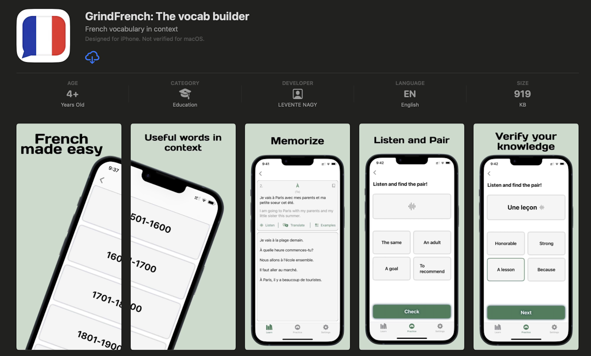

# Leventen Studios Apps

Hi, I'm Levente Nagy, a fulltime software and an indie iOS app developer. Please enjoy the apps created by the studio.

## My apps:
Learn the top 2000 French words with native iOS voices. Practice offline with matching games. Build your French vocabulary with the most frequent words and engaging practice modes.
GrindFrench is a thoughtfully designed language learning app focused on helping you build and reinforce your French vocabulary through listening, matching, and word recognition games.

Build vocabulary, test your knowledge. Grinding is the only way, give it a go! It's free, new updates are on the way! Checkout the app at the [AppStore](https://apps.apple.com/ca/app/grindfrench-the-vocab-builder/id6747348434)

Support if you can at [BuyMeACoffee](https://buymeacoffee.com/leventenstudios)

To see how your personal information is handled, go to the [Privacy Policy](./privacy-policy.html) page. In case of any issues please [contact us](mailto:leventenstudios@icloud.com).
